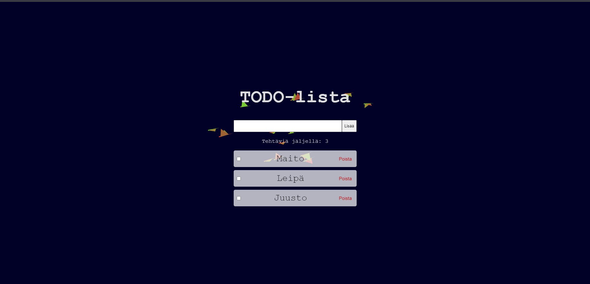

# Projektin nimi ja tekijät
Projektin nimi: TODO lista 2
Tekijät: Leevi Saajoranta 

## Verkkolinkit:
Pääset julkaistuun sovellukseen käsiksi osoitteessa [google.com](https://leevisaajoranta.github.io/WEB-kehitys--projekti-3/)

Linkki projektin Netlify sivulle [netlify.com] (https://app.netlify.com/projects/todolista2/overview)

## Työn jakautuminen 
Tein projektin yksin joten projekti jakautui vain minulle

## Oma arvio työstä ja oman osaamisen kehittymisestä
Mielestäni onnistuin käyttämään hyvin ulkoista kirjastoa
Sovelluksesta jäi puuttumaan...
Koen, että olen oppinut, miten ulkoisia kirjastoja hyödynnetään
Antaisin itselleni pisteitä seuraavasti: 8/10 p

## Palaute opettajalle kurssista sekä itse opetuksesta tähän saakka
Kurssi on tuntunut mukavalta ja rennolta. Pidän siitä, että kurssilla saa edetä omaan tahtiin 

## Sisällysluettelo:

- [Tietoja sovelluksesta](#tietoja-sovelluksesta)
- [Tunnetut Virheet](#Tunnetut-virheet)
- [Kuvakaappaukset](#kuvakaappaukset)
- [Teknologiat](#teknologiat)
- [Asennus](#asennus)
- [Kiitokset](#kiitokset)

## Tietoja sovelluksesta
TODO lista 2 on sovellus, jolla voit merkata tehtäviä todo-listaan

## Tunnetut virheet
Virheitä on sen verran, että sovellus ei tallenna localStorageen, vaan pelkästään sessionStorageen.

## Kuvakaappaukset
Lisää tähän vähintään yksi kuvakaappaus toimivasta sovelluksesta  

## Teknologiat
Kuvaa, mitä teknologioita käytettiin ja mikä oli niiden rooli projektissasi.  
Käytin seuraavia teknologioita: `html`, `css`, sekä `JavaScript`

html: Toimi pohjana sivustolle
css: Värit, fontit, fontti koot
JavaScript: Toiminnallisuudet kuten napit sekä taustalla lentävät linnut käyttäen ulkoista kirjastoa 

## Asennus   
- lataa tai kloonaa repositorio  
- Avaa Visual Studio Code 
- Avaa index.html
- Avaa tiedosto oletus selaimessasi
- Nyt voit käyttää TODO listaa vapaasti

## Kiitokset
Projektissa käytettiin hyödyksi opettajan kurssimateriaalia, sekä ChatGPT tekoälyä 
